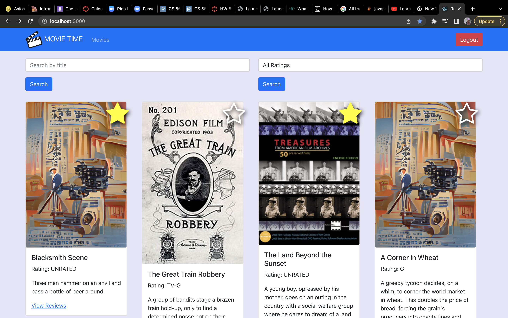
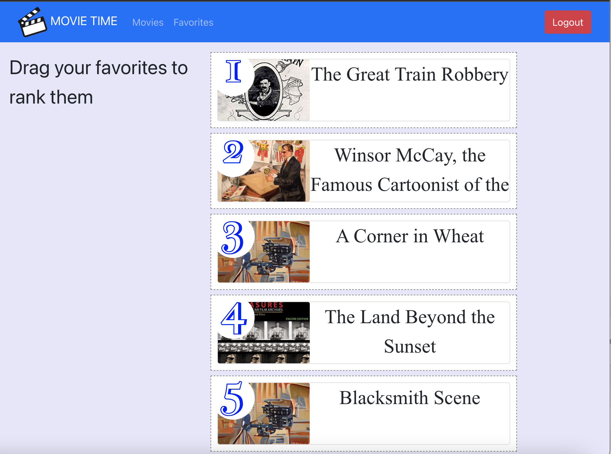
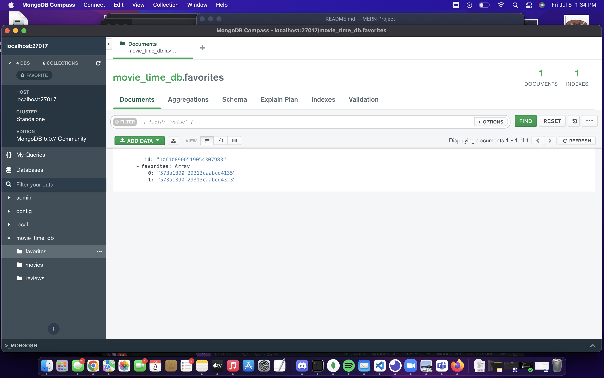

# MERN Project: Movie Time

The goal of this application is to populate movies from a movies database. Users can browse through the movies, add reviews, and favorite the movies they enjoyed.

## Project Description

Using the MERN stack (MongoDB, Express, React.js, and Node.js), the Movie Time is a RESTful API that's implemented for movie enthusiasts to explore different movies, share their thoughts on them, and rank their favorite ones. React DnD was also used to create a drag and drop feature for the ranking system. Since this project was the kickstarter for learning the MERN stack, there was a big learning curve in understanding the usage for the functions. With a better understand of MERN, possible future implementations can consist of creating a personalized profile page for each user showcasing their reviews and ranked favorites.

## Table of Contents
1. [ What the Repository Contains ](#repo)
2. [ The Favorites Ranking Page ](#ranked)
3. [ How to Install and Run the Project ](#installation)
4. [ How to Use the Project ](#usage)
5. [ Credits ](#credits)

## What the Repo Contains

The repository, lenaduong-frontend, contains the frontend portion of the application and the repository labed as lenaduong-backend contains the backend portion of the application.

#### lenaduong-frontend:

- <b>images</b>: Containing images for the README.md
- <b>public</b>: Storing the files to run the frontend.
    - <b>images</b>: Default image for movies with no image available and movies logo
    - <b>src</b>: Services to retrieve information from the backend and components for the additional features to the application. It also contains app.js where the function of the application lies and test files.
        - <b>components</b>: favorites list, movie list, login, logout, etc. help run the application and it is where it stores the features. 
        - <b>services</b>: classes that retrieves information from the backend using axios.

#### lenaduong-backend:

- api: The controller for the movies, favorites, and reviews. It additionally contains the movies route.
- dao: The Data Access Objects to retrieve information from the database. Items in the DAO includes favoritesDAO, moviesDAO, and reviewsDAO.

## The Favorites Ranking Page

For the latest submission, I started by creating an api that would generate the information we need for the favorites card. It integrated the FavoritesDAO.getFavorites() and MoviesDAO.getMovieById to populate information about the user's favorite movie: the movie id, title, poster image. After doing so, I implemented the functions in the frontend app.js to save the favorites list into a useState. That useState gets passed along to container.js which contains information about the cards. As the cards gets shifted when the user drags and drops, a call to a function in app.js is called and passes the new array of reordered card to update the previous favorites array.

## How to Install and Run the Project

The project can be seen and fully ran on [heroku for frontend](https://movietime-frontend-lenaduong.herokuapp.com/) and [heroku for backend](https://movietime-backend-lenaduong.herokuapp.com/).

To run it locally on the computer after cloning the two repos, type `npm start` in the frontend terminal and type `node index.js` in the backend terminal.

## How to Use the Project

    - Project was built using MERN stack
    - Google OAuth is used for authentication and will need to authorize the proper urls.
    - frontend is running on port: 3000
    - backend server is running on port: 5001
        - backend uses `/api/v1/movies` URI
    

## Credit

CS5610 at NEU with professor Tony Mullen.